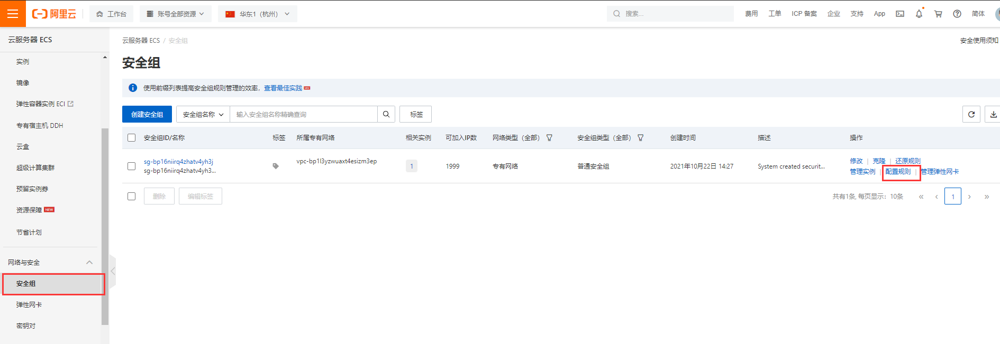
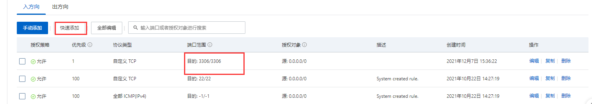

## 阿里云服务器

### 1.使用vagrant安装centos/7

- 卸载vagrant 

> rm -rf /opt/vagrant
> rm -f /usr/local/bin/vagrant

- 下载vagrant

```
安装本地brew：curl -fsSL https://gitee.com/cunkai/HomebrewCN/raw/master/Homebrew.sh
安装vagrant：brew install vagrant
```

- 下载centos/7

### 2.白嫖阿里云服务器

[白嫖连接](https://developer.aliyun.com/adc/student/?userCode=vgucw2zn)

个人认证和学生认证就好了。阿里云服务器使用的操作系统是centos，我的[密码](Ybfq19951226:)。

#### （1）搭建环境

- 下载mysql和redis

> - 安装docker
>
> ​	使用国内daocloud一键安装：`curl -sSL https://get.daocloud.io/docker | sh`
>
> 为docker配置镜像加速
>
>    [在阿里云官网上获取命令]( https://cr.console.aliyun.com/cn-hangzhou/instances/mirrors)

> - 安装mysql
>
>   1.`docker pull mysql:5.7`
>
>   2.创建并启动实例
>
>   ```docker run --privileged=true --name mysql -p 3306:3306 -v /home/zhengyunfei/docker/mysql/data:/var/lib/mysql -e MYSQL_ROOT_PASSWORD=root -d docker.io/mysql:5.7```
>
>   3.创建配置文件my.cnf
>
>   cd /home/zhengyunfei/docker/mysql/data/mysql
>
>   在这个目录下：vi my.cnf
>
>   然后复制;
>
>   ```[client]
>   default-character-set=utf8
>   [mysql]
>   default-character-set=utf8
>   [mysqld]
>   init_connect='SET collation_connection = utf8_unicode_ci'
>   init_connect='SET NAMES utf8'
>   character-set-server=utf8
>   collation-server=utf8_unicode_ci
>   skip-character-set-client-handshake
>   skip-name-resolve
>   ```
>
>   4.进入mysql命令
>
>   `docker exec -it mysql /bin/bash `
>
>   查看本机镜像：`docker images`
>
>   查看开启服务：`docker ps`
>
>   5.设置mysql开机自启
>
>   `docker exec -it mysql /bin/bash `
>   
>   6.将3306端口加入到防火墙中。
>   
>   
>   
>   

> - 安装redis
>
> 1.下载redis镜像文件：docker pull redis
>
> 2.创建实例并启动：
>
> mkdir -p /mydata/redis/conf。
>
> 然后切换到conf文件夹，touch redis.conf。
>
> docker run -p 6379:6379 --name redis -v /mydata/redis/data:/data -v/mydata/redis/conf/redis.conf:/etc/redis/redis.conf -d redis redis-server /etc/redis/redis.conf。
>
> 
>
> 表示安装成功。
>
> 可以使用docker ps检查一下是否成功
>
> 3.使redis内存持久化：
>
> 切换到redis挂载的目录，在这里是/mydata/redis/conf，也可以使用pwd命令。
>
> 修改配置文件：vi redis.conf
>
> 在配置文件中添加一句话：appendonly yes
>
> 重启reids：docker restart redis
>
> 配置结束。
>
> 3.测试redis是否正常使用
>
> docker exec -it redis redis-cli:进入redis客户端
>
> set a b:存入数据key-value
>
> get a: 结果是"b"
>
> 重启redis在来一遍，如果结果依然是b说明成功。
>
> 4.设置开机自启redis
>
>    docker update redis --restart=always

> - mysql高可用解决方案：主从复制
>
> 简单来说，把一台服务器当作主服务器，其他服务器（一台或多台）当作从服务器，主从复制就是从服务器从主服务器拉取二进制日志文件，然后在从服务器上执行一遍，保证和主服务器上数据一致。
>
> ​	但是，当主服务器出现问题的时候就需要手动处理故障转移了，通常是把从服务器改为主服务器，在主从复制一遍。

