# 第二天

## 1 连接数据库

代码分层如图所示，把resources当中不需要的文件删掉。mapping存放sql代码。

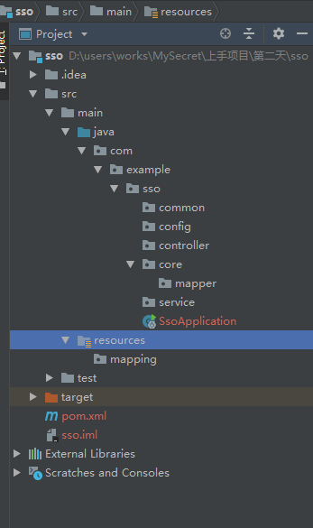

然后在resources当中建立yml配置文件，这个文件用于存放一些配置和注入字段。

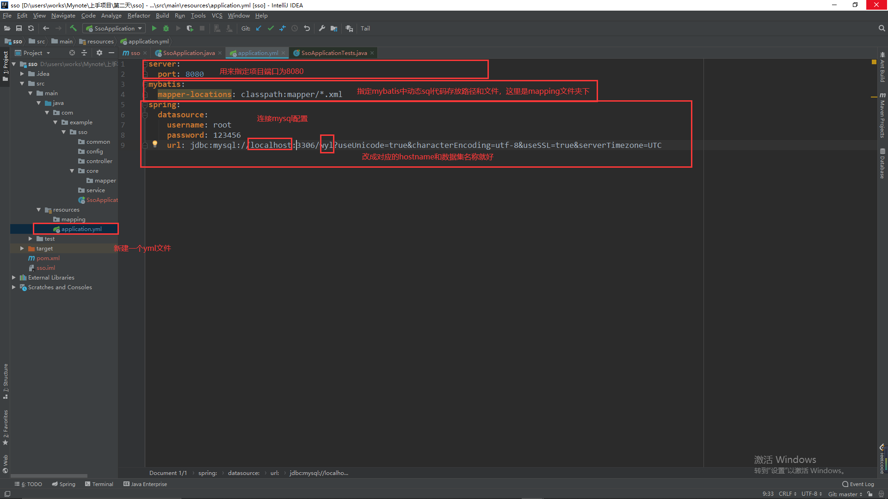

> 跑一遍项目，没报错说明语法没错，至于是不是连接上了，还要通过代码测试。怎么测试后面再说。

## 2 熟悉数据库

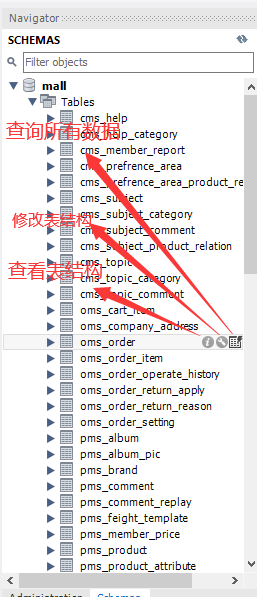

可以熟悉下oms_order和oms_order_item这两张表。

[参考项目地址](http://www.macrozheng.com/#/foreword/mall_foreword_01)

## 3 配置maven

1 [maven下载地址](https://maven.apache.org/download.cgi)

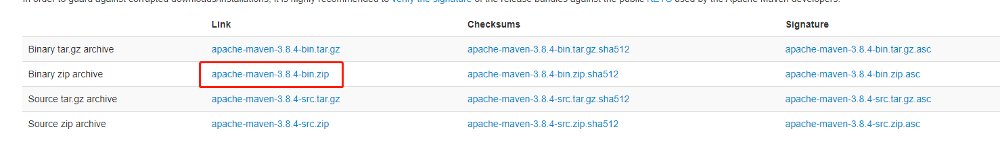

2 解压后打开conf里的setting.xml文件，全部替代为[博客里的内容](https://blog.csdn.net/qq_25925973/article/details/82391940)。

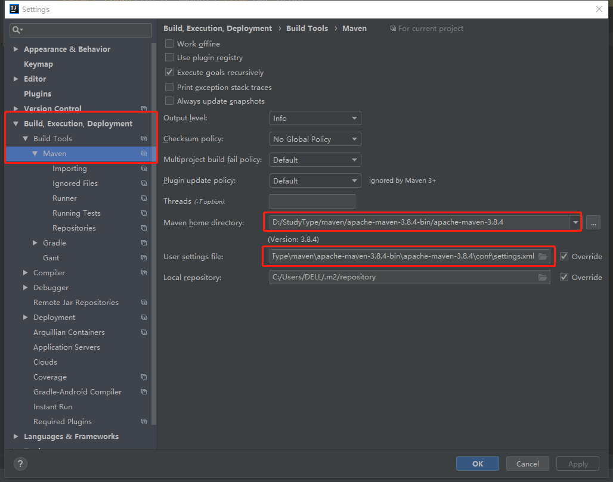

将图中路径代替为自己下载的文件。

## 4 数据库测试代码

### 一、在pom文件中加入mybatis依赖。

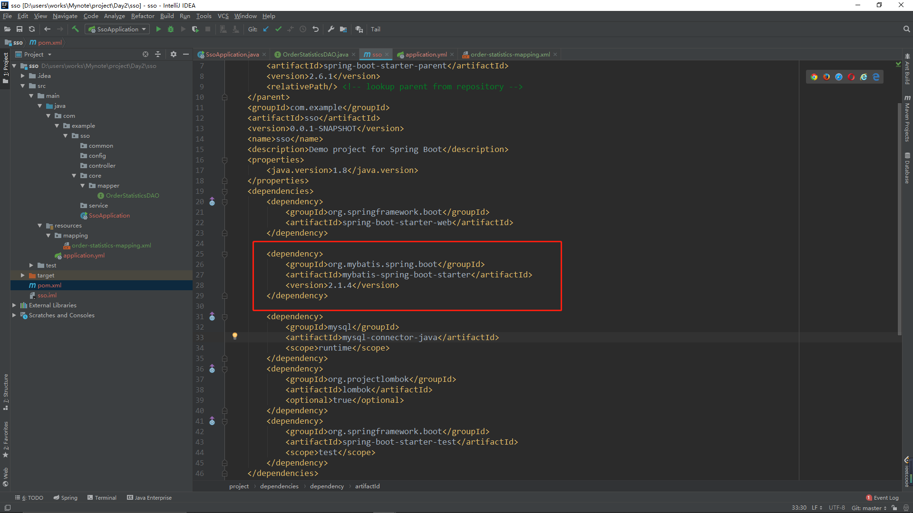

### 二、业务代码

业务代码一般由三个部分组成：

> 1 core层：DAO接口和sql代码，这是mybatis直接和数据库交接的代码。
>
> 2 service层：处理业务逻辑的代码，代码量最多。一个完整的service包括接口和impl文件，接口用来调用方法，impl用来写方法逻辑。
>
> 3 controller层：这是唯一暴露在外的接口代码，代码量要保证少、简洁。

我们现在要求出订单总额，是用到oms_order这张表。

#### 1）core层

新建两个文件，一个是DAO接口，一个是sql代码文件。

DAO中的@Mapper是一个注解，项目启动的时候通过注解来扫描文件。

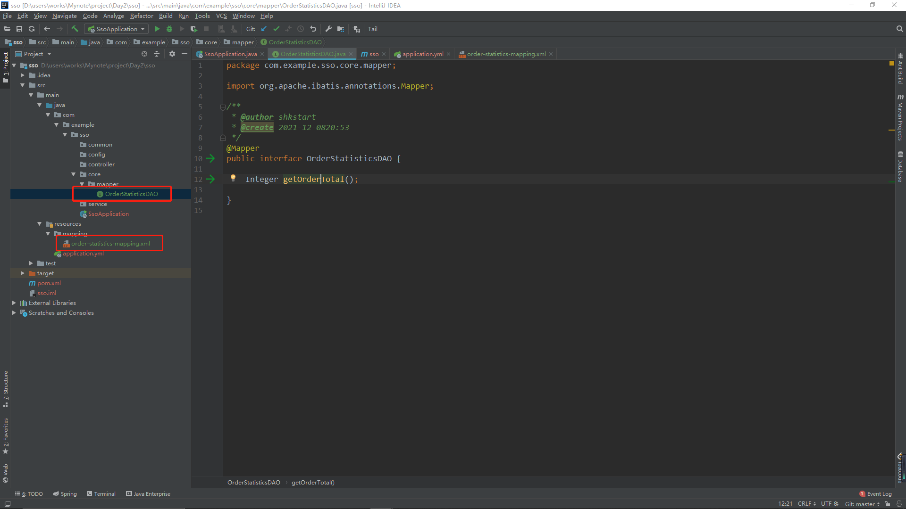

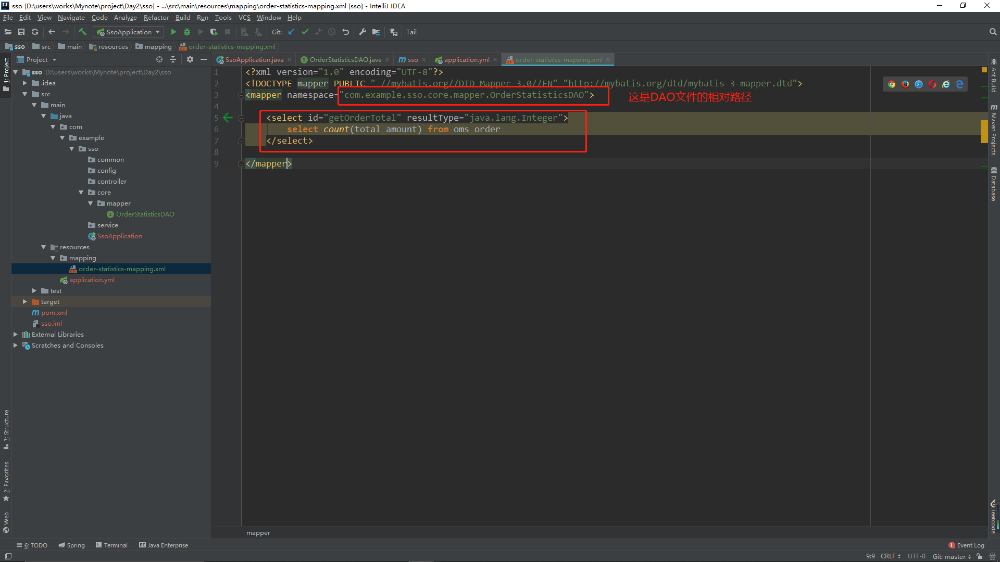

#### 2）service层

1 新建文件夹impl，接口和Java文件，注意它们的命名特点。

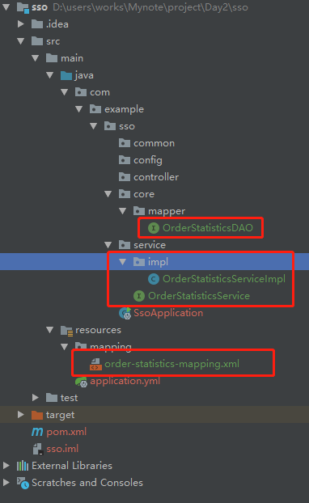

2 在service接口中定义方法

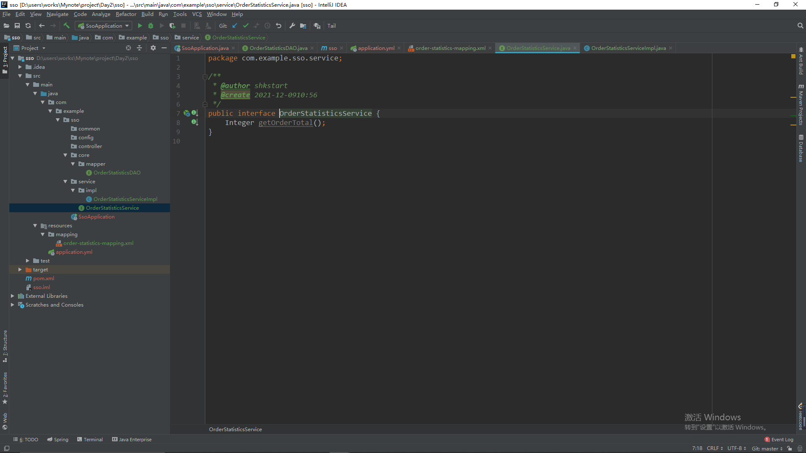

3 在impl中继承service接口，并加上@service注解。

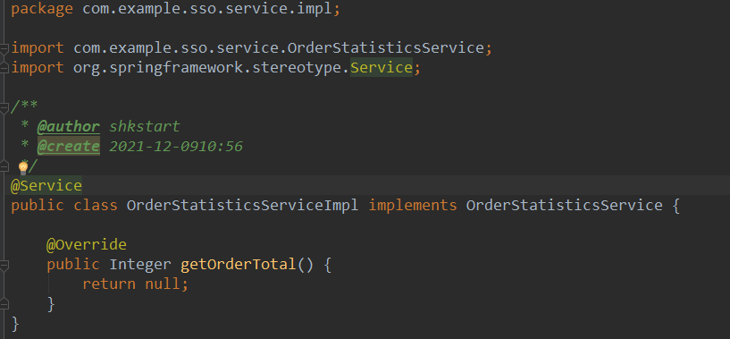

alt+enter可以查看报错信息。

4 写逻辑代码，我们在service层要用到数据库的数据，所以要调用数据库接口。

调用之前先声明，我们用@Resources声明。

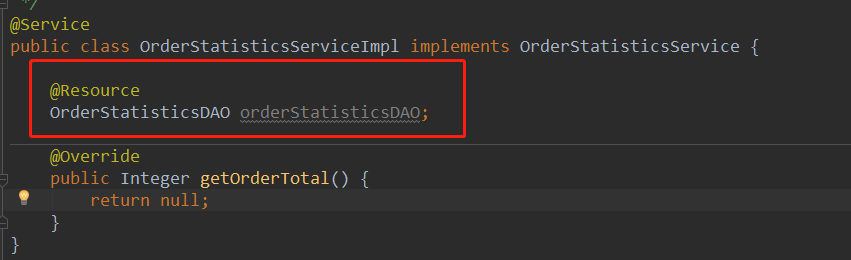

写业务逻辑。

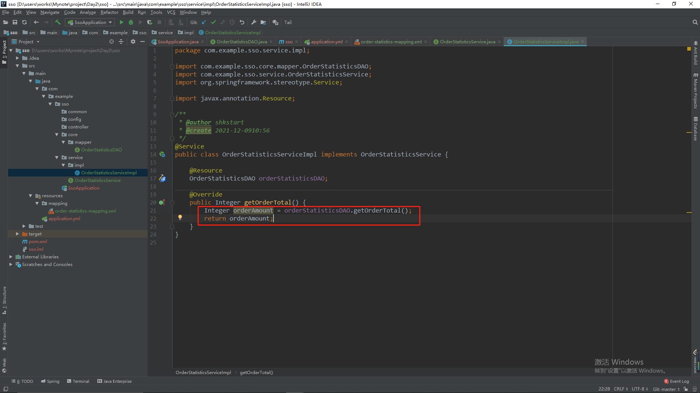

4 controller层

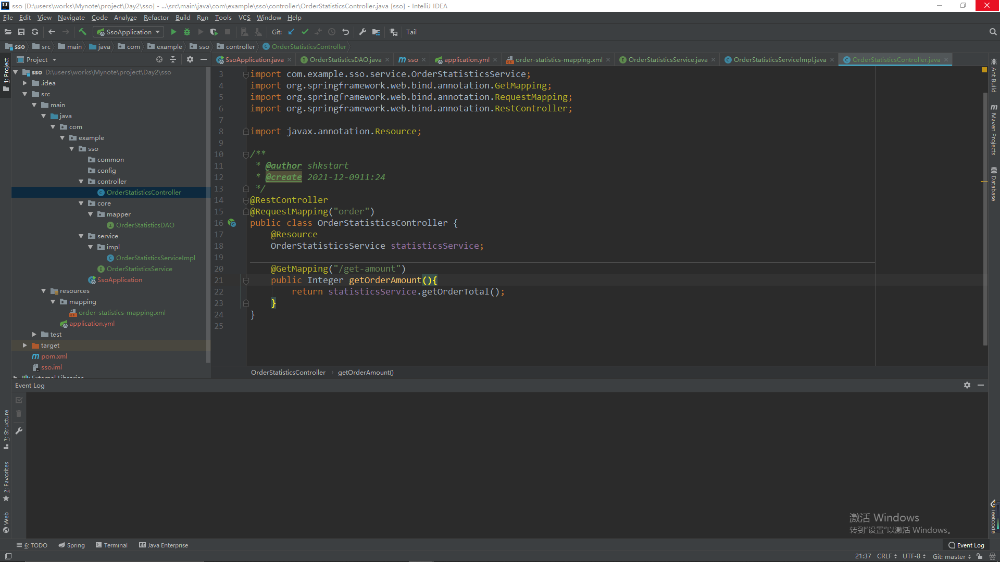

@RequstController：controller接口都需要这个注解，程序启动时会根据这个注解扫描。

@RequestMapping和@GetMapping：接口的入口地址，这就是网站的网址。

@Resources：我们声明使用OrderStatisticsService接口。

## 三、测试接口

下载postman测试软件，[下载地址](https://www.postman.com/)

> 运行项目

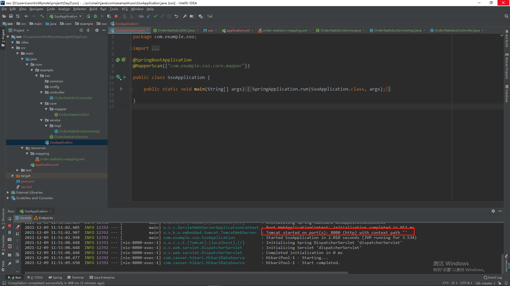

> 在postman中测试，在网址中写本机地址就好。然后点send测试，发现返回的值为15；

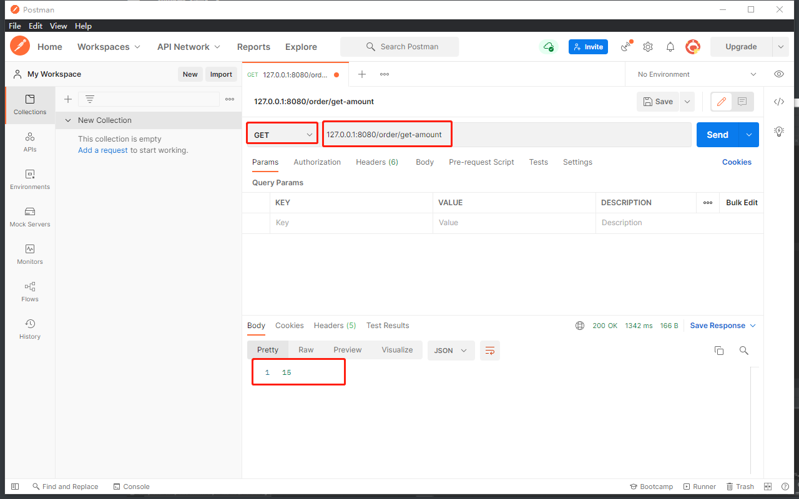

> 验证这个结果是否正确。

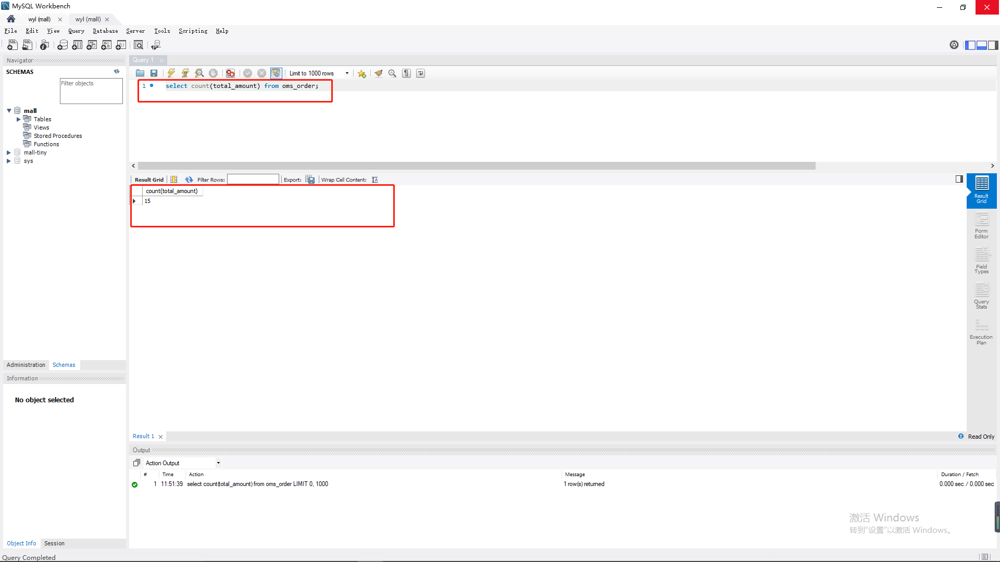

结果正确，测试完毕。

> 在postman中，将刚刚测试的接口保存到collection中，具体做法是：
>
> ​	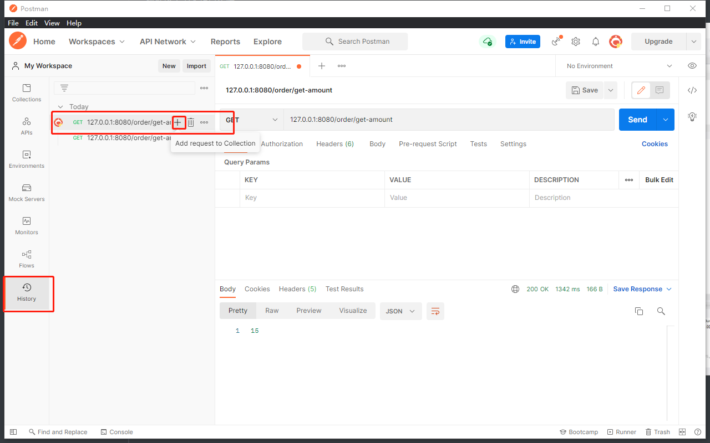
>
> 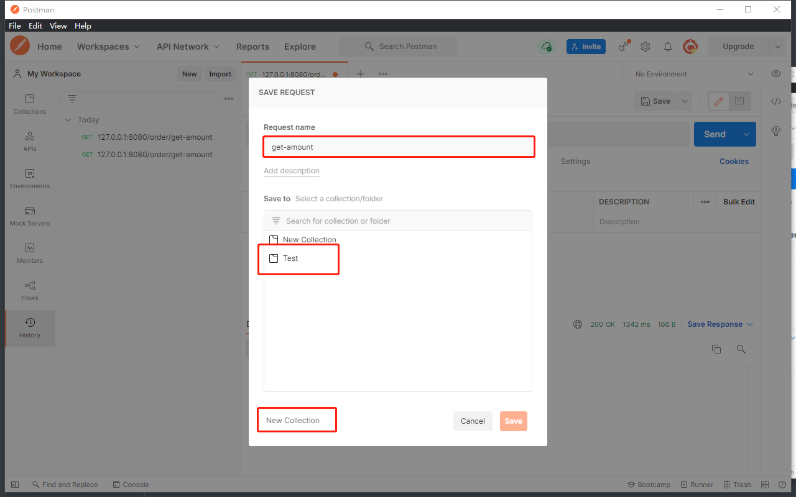
>
> 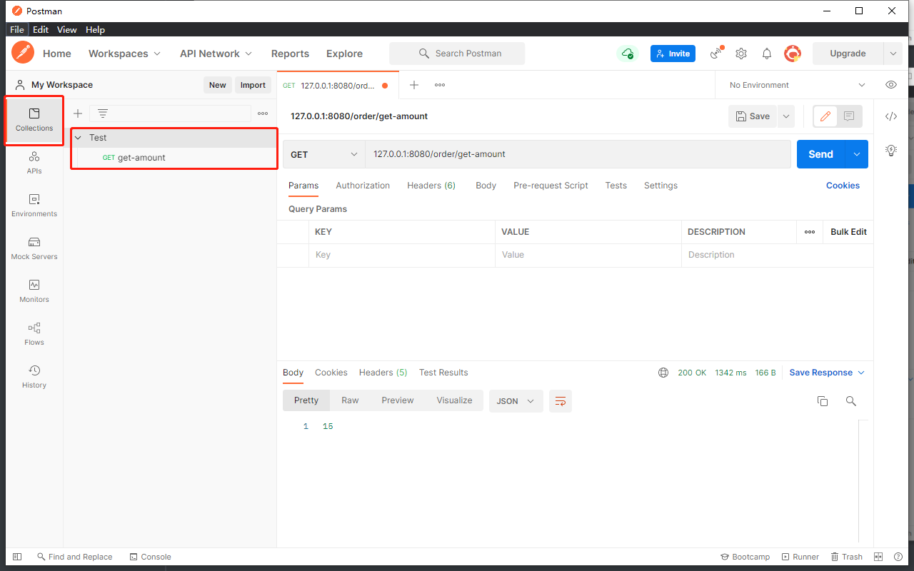
>
> 这么做是为了方便以后使用到它的时候，不用重新输入网址和参数。

