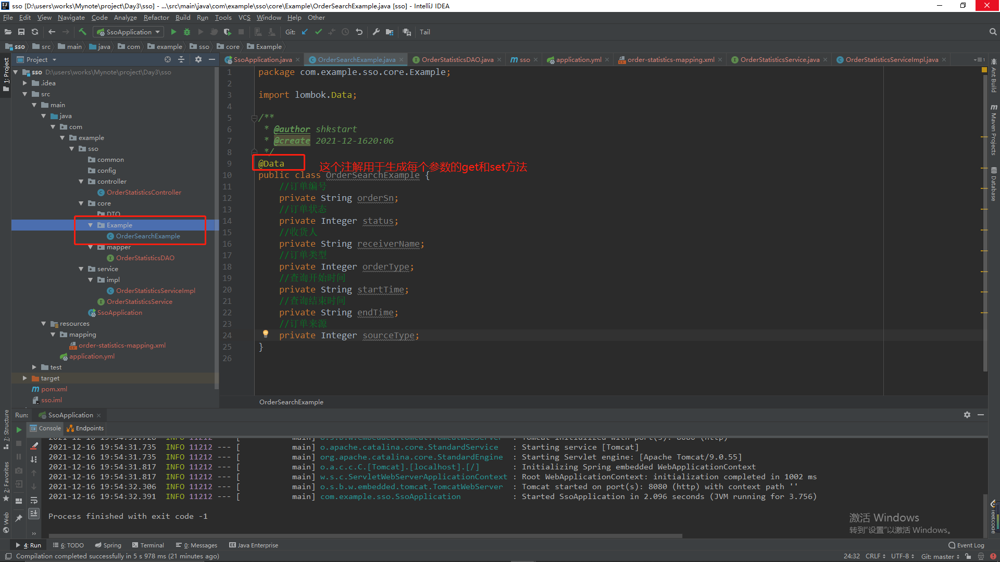
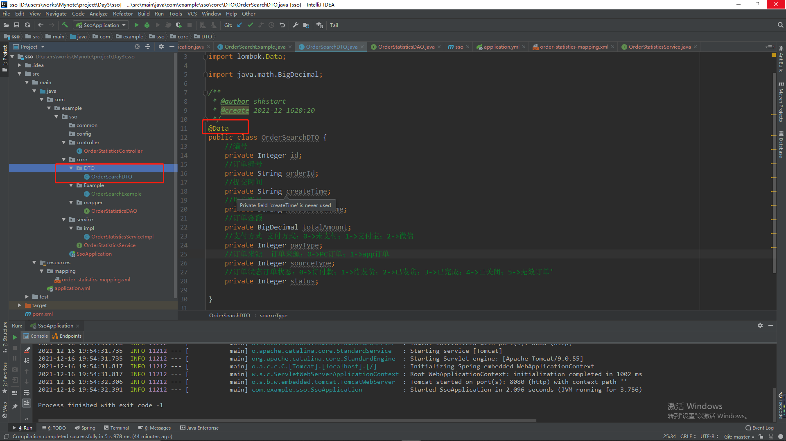

# 订单小业务

[业务需求](ttps://shimo.im/docs/yVHCRhdTwWygxHrc)

1.新建一个搜索条件类OrderSearchExample：

```java
	//订单编号
    private String orderSn;
    //订单状态
    private Integer status;
    //收货人
    private String receiverName;
    //订单类型
    private Integer orderType;
    //查询开始时间
    private String startTime;
    //查询结束时间
    private String endTime;
    //订单来源
    private Integer sourceType;
```




2.新建业务响应类OrderSearchDTO，也就是最终要输出的信息。

```ini
OrderSearchDTO包含的字段：
编号：int id
订单编号：String orderId;
提交时间：String createTime;
用户账号：String  menmberUsernameame;
订单金额：Decimal totalAmount;
支付方式：int payType;支付方式：0->未支付；1->支付宝；2->微信
订单来源：int sourceType;订单来源：0->PC订单；1->app订单
订单状态：int status;订单状态：0->待付款；1->待发货；2->已发货；3->已完成；4->已关闭；5->无效订单'
```



