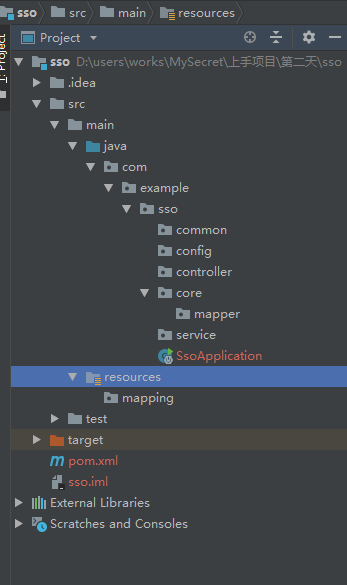
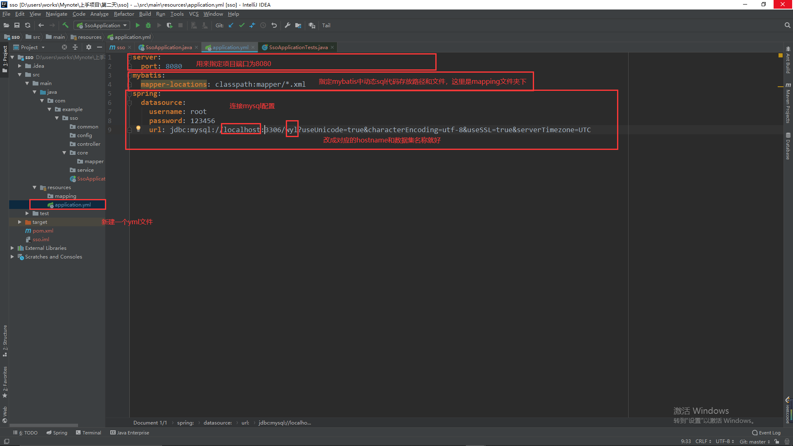
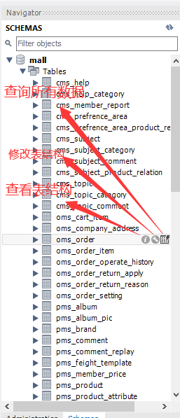

# 第二天

## 1 连接数据库

代码分层如图所示，把resources当中不需要的文件删掉。mapping存放sql代码。

然后在resources当中建立yml配置文件，这个文件用于存放一些配置和注入字段。

> 跑一遍项目，没报错说明语法没错，至于是不是连接上了，还要通过代码测试。怎么测试后面再说。

## 2 熟悉数据库

可以熟悉下oms_order和oms_order_item这两张表。

[项目地址](http://www.macrozheng.com/#/foreword/mall_foreword_01)

## 未完待续！
