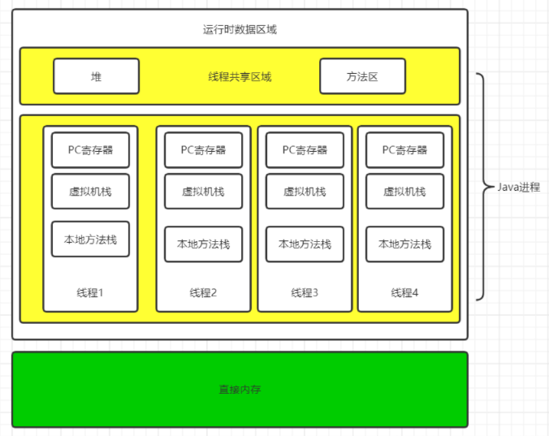

# 并发的底层实现

**这部分内容解决共享资源同步访问问题**

## 共享变量

这是jvm中所有的线程共享的部分，也就是堆和方法区。

- 堆：所有的对象都存放在堆内。
- 方法区：存放类的加载信息、常量、静态变量。

多线程共同访问共享变量，就必须保证数据的准确和一致。

## volatile关键字

### 保证可见性

volatile是轻量级的synchronized，没有上下文切换问题，所以执行成本更低。

#### volatile的读与写

- 写：写一个volatile变量时，会把工作内存的变量值刷新到主内存中。
- 读：读一个volatile变量是，会把工作内存置为无效，直接从主内存中读取共享变量。

### 禁止指令重排

## synchronized关键字