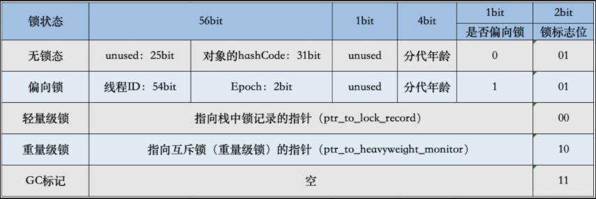

# 并发的底层实现

**这部分内容解决共享资源同步访问问题**

## 共享变量

这是jvm中所有的线程共享的部分，也就是堆和方法区。

- 堆：所有的对象都存放在堆内。
- 方法区：存放类的加载信息、常量、静态变量。

多线程共同访问共享变量，就必须保证数据的准确和一致。


## volatile关键字

### 保证可见性

volatile是轻量级的synchronized，没有上下文切换问题，所以执行成本更低。

#### volatile的读与写

- 写：写一个volatile变量时，会把工作内存的变量值刷新到主内存中。
- 读：读一个volatile变量是，会把工作内存置为无效，直接从主内存中读取共享变量。

### 禁止指令重排（有序性）

volatile靠内存屏障来禁止指令重排


内存屏障只是一种指令。

### 不保证原子性

## synchronized关键字

synchronized锁主要用来给方法上锁。有三种形式：

- 普通同步方法：给方法所在的类的对象上锁
- 静态同步方法：给方法所在类的class对象上锁
- 同步方法：给synchronized括号里的配置类对象上锁

任何一个对象都有一个monitor与之关联，当monitor被持有之后，就会处于锁定状态。

- 当线程获取锁时，把线程对应的本地内存置为无效，被监视器保护的临界区代码必须从主内存中获取共享变量值。
- 当线程释放锁时，jmm会把本地内存的变量值同步到主内存中。

### synchronized底层

synchronized锁放在对象头里，占64个字节。



#### ptr_to_lock_record

当锁获取时无竞争时，jvm使用原子类操作而不是互斥，这就是轻量级锁定。

#### ptr_to_heavyweight_monitor

重量级锁，指针指向监视器monitor，如果有多个线程在对象上产生竞争，必须把对象的轻量级锁升级到monitor以管理等待的线程。

## 锁的升级与对比

锁的状态只能升级不能降级，为的就是提高使用锁的效率。

```ini
我们给对象上锁时，通过比较与设置（CAS）（compare and swap)。比较新值与旧值，来修改旧值。
```

### 无锁态

### 偏向锁

一个锁总是被一个线程获取，而不存在竞争，这时候就使用偏向锁。

#### 偏向锁上锁流程


#### 锁撤销

等到有线程竞争的时候才会释放。

### 轻量级锁

- displace Mark Word：在线程中开辟空间，用于锁记录，将对象头中的Mark Word复制到锁记录中。

#### 加锁

线程使用CAS，将对象头中的Mark Word替换为锁记录的指针

如果成功，就获得锁。

如果失败，表明有其他线程竞争，通过自旋来尝试获取。

#### 解锁

使用CAS的原子操作将Mark Word替换回到对象头中，

如果成功，表示没有竞争。

如果失败，表示有竞争力，那么轻量级锁升级为重量级锁。

### 重量级锁

### CAS问题（ABA）问题

A->B->A，那么可以在aba前面追加一个版本号，那么除了比较新值和旧值之外，还要比较版本号。1A->2B->3A
