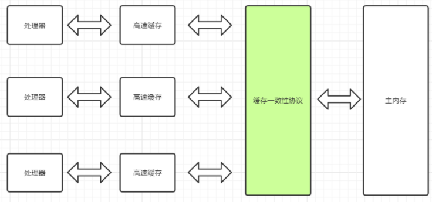
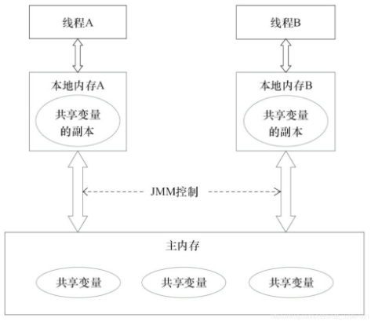

# 二、JMM内存模型

> 这一单元解决的问题是：
>
> - 回答了JMM存在的意义
> - 解决并发编程的线程同步问题
> - 定义了工作内存和主内存交互规则
> - 由此衍生出了JMM三大特性，保障多线程正确运行
>
> 

## 1.处理器内存模型

首先搞懂两个概念，处理器运行速度和计算机存储设备运算速度。计算及存储设备的运行速度远远小于处理器速度。



为了解决运算冲突，处理器和内存之间加了一层高缓存cache来作为缓冲。

但是这样做出现了一个问题：

```ini
一台主机有多个处理器，每个处理器有自己的高速缓存，但是他们共享同一个主内存，这就导致了他们的缓存数据不一样（可见行问题）
:这就是缓存一致性问题。
处理器对代码乱序执行，然后又将乱序结果重组（有序性问题）:这个问题很不理解什么意思
:处理器和编译器会对我们写的代码进行优化，优化的过程就是重排代码。
```

## 2.并发编程的两个关键问题

```ini
线程通信
线程同步
```

### 2.1线程通信

线程通信是指线程之间交换信息。线程通信机制有两种：共享内存和消息传递。

- 共享内存：如果线程之间有公共状态，那么就通过读写公共内存状态来隐式的通信（共享变量是可见的）
- 消息传递：线程之间没有公共状态，必须通过发送消息来显式的通信

### 2.2 线程同步

线程同步是指操控线程之间执行的相对顺序。

- 共享内存，同步必须指定某个方法或者代码段需要在线程之间互斥执行。是显式的。
- 消息传递：同步需要发送消息在接受消息之前，是隐式的。

```ini
Java并发使用的是共享内存，使用共享变量
```

## 3.内存交互操作的三大特性

这三点非常重要

- 原子性：一个线程要不全部执行完，要不都不执行。
- 可见性：多个线程访问同一个变量的时候，一个线程修改了值，其他线程立刻就能知道。
- 有序性：线程内串行，线程间并发。

## 4.JMM基本结构

jmm是用来定义程序中各变量的访问规则的，也就是虚拟机将变量存到内存和从内存中取出的底层细节。



```ini
工作内存就是本地处理器的高速缓冲区。
```

###  工作内存和主内存

- 共享变量存在主内存中
- 线程对共享变量的操作都在工作内存中。
- 线程之间是不可以直接访问对方的主内存中的共享变量，只能通过主内存来传递变量值。

### 内存间交互操作

主内存和工作内存的交互存在某种协议。也就是规定。

工作内存指的是线程的工作内存

| 协议名          | 作用在   | 作用                                                         |
| :-------------- | -------- | ------------------------------------------------------------ |
| lock（锁）      | 主内存   | 线程独占                                                     |
| unlock（解锁）  | 主内存   | 释放之后才能被其他线程锁定                                   |
| read（读取）    | 主内存   | 把共享变量的值传输到工作内存中，以便load使用                 |
| load（载入）    | 工作内存 | 把上述的值放到工作内存的共享变量副本中                       |
| use（使用）     | 工作内存 | 把共享变量的值传给执行引擎，每当虚拟机遇到需要使用共享变量的字节码指令的时候就执行这个操作 |
| assigin（赋值） | 工作内存 | 从执行引擎接收到的值赋给工作内存的共享变量。                 |
| store（存储）   | 工作内存 | 把工作内存的共享变量的值传给主内存中，以便后来的write操作    |
| write（写入）   | 主内存   | 把值赋给主内存中的共享变量                                   |

执行流程为：


### 交互操作的冲突

- 一个变量同一时间只能被一条线程lock，并且lock操作可以被多次进行。此时只有执行相同次数的unlock操作才可以被释放。--synchronized实现重入锁的基石。
- 一个变量执行unlock之前，必须把变量的值同步回住内存中。

## 5.指令重排

编译器和处理器优化程序性能而做的指令重排序。

>顺序执行原则

- 程序次序：按照控制流顺序执行而不是代码顺序
- 传递行
- 对象终结规则

> 锁定和读写原则

- 管程锁定规则：monitorA和monitorB先后锁定同一个变量，只有等前一个unlock了之后后一个monitor才能lock。（这不是废话嘛）（相当于synchronized锁）
- volatile变量规则：volatile是修饰变量的，对volatile变量的写操作早于读操作。（线程1写了volatile变量v，线程2读volatile变量时候，可以看到线程1对v的写操作。再进一步举例子就是，线程1从主内存中取出变量v的值给自己的副本变量v1->改变v1的值->store，write进主内存变量v->此时，线程2就能读取到改变后的v值）。

## 6.JMM三大特性实现

### 原子性

- synchronized关键字：synchronized块之间的操作具备原子性。虚拟机提供了monitorenter和monitorexit字节码指令来隐式的使用lock和unloch操作，这两个字节码指令体现在代码中就是synchronized块。
- 原子类的CAS操作也具备原子性。

### 可见性

一个线程修改了共享变量的值，其他线程可以立即得知这个修改。线程修改了共享变量的值，然后将新的值同步到主内存中。

- volatile关键字：volatile修饰的变量保证新值能立即被同步到主内存中。
- synchronized关键字：在执行unlock操作之前，必须把新值刷新到主内存中。
- final关键字：被final修饰的变量一旦在构造器中初始化完成，就能被其他线程看到。

### 有序性

有序性体现在：在线程内，操作都是有序的，在线程外看一个线程的操作，都是无序的。也就是说在线程内是串行执行，但是会有指令重排、工作内存和主内存同步延迟现象。

- volatile关键字：volatile使用禁止指令重排语义来保证有序性。
- synchronized关键字：同一个变量在同一时刻只允许一条线程对其锁定。这个规则决定了持有同一个锁的两个同步块只能串行的进入，指令在临界区内可以重排，但不会影响最终执行结果
