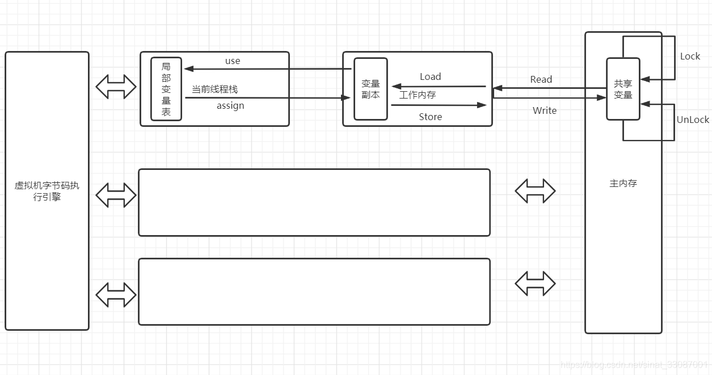

# 一、并发的优势与挑战

## 1.什么是并发

串行：顺序做不同的事情

并发：交替做不同的事情，关注的是资源的充分利用，不让cup停下来，为了更快的完成一件事情，一个任务交给多个执行者同时做。

并行：同时做不同的事情

## 2.上下文问题

即便是单核处理器也支持多线程，cup通过给每个线程分配时间片来实现多线程。当前任务执行一个时间片之后会切换到下一个任务，但是在切换之前会保存当前的状态，然后下次切换回来的时候从这个保存的状态开始执行，那么一次保存状态到重新加载的过程就是一次上下文切换。

这个过程是有cup开销的，所以有时候多线程执行起来还不如单线程块。

## 3.如何减少上下文切换

### 3.1无锁并发编程

执行任务的时候，多线程竞争锁会引起上下文切换，我们可以用别的办法来避免使用锁，比如将数据取模分段，不同的线程处理不同段的数据。

### 3.2CAS算法

一种更新数据的算法，不需要使用到锁。

### 3.3使用少线程

创建适量的线程，避免大量线程处于等待状态。

### 3.4使用妥协

使用单线程来维持多个任务的切换。

```ini
总结:使用适量线程，尽量少用锁，执行内容分配前置，上下文切换就会变少。
```

## 4 死锁问题

多线程并发节约了cup资源，那么就会访问共享的和可能已经变化的资源，这样是有线程安全问题的。所以我们要保证共享的和可变的资源不被错误的执行，就会使用到锁。

```java
public class ThreadTest{
  Object moniterA = new Object();
  Object moniterB = new Object();
  /**
  * 创建第一个锁
  */
  Thread t1 = new Thread(() -> {
    synchronized(moniterA){
      Thread.sleep(2000);
      synchronized(moniterB){
        println("A");
      }
    }
  });
  Thread t2 = new Thread(() -> {
    synchronized(moniterB){
      Thread.sleep(2000);
      synchronized(moniterA){
        println("B");
      }
    }
  });
  t1.start();
  t2.start();
}
```

**为什么会陷入死锁**

## 5.如何避免死锁

一个线程拿到锁之后因为异常没有释放掉锁，或者释放锁的时候跑出异常没有释放。这样就会造成死锁为题。

- 不要一个线程同时占用多个锁。
- 不要一个线程在锁内同时占用多个资源，也就是每个锁只用一个资源。
- 使用锁的时候，使用lock.tryLock(timeout)来代替内部锁，定时锁的好处是，当释放锁失败时候到期释放。
- 对于数据库锁，加锁和解锁必须在一个数据库连接中。不然会解锁失败

```ini
总结:一个线程只能使用一个定时锁去锁住一个资源。
```

## 6.资源限制

在并发编程时，我们往往受限于计算机硬件和软件资源。

- 硬件资源：宽带、硬盘读写速度、cup处理速度
- 软件资源：数据库连接数和socket连接数

```ini
并发是为了使代码执行更快，原则是把部分串行改成并发执行，但是如果受限于硬件资源，仍然在串行，那么返回会变得更慢。
```

解决方法：

- 硬件资源：考虑分布式集群来并发执行
- 软件资源：考虑使用资源池复用资源

```ini
总结:解决资源受限，就是分布式集群的搭建和资源池建立和复用。
```

```ini
大总结:并发， 上下文切换， 死锁， 资源受限
```

# 二、JMM内存模型

> 这一单元解决的问题是：
>
> - 回答了JMM存在的意义
> - 解决并发编程的线程同步问题
> - 定义了工作内存和主内存交互规则
> - 由此衍生出了JMM三大特性，保障多线程正确运行
>
> 

## 1.处理器内存模型

首先搞懂两个概念，处理器运行速度和计算机存储设备运算速度。计算及存储设备的运行速度远远小于处理器速度。


为了解决运算冲突，处理器和内存之间加了一层高缓存cache来作为缓冲。

但是这样做出现了一个问题：

```ini
一台主机有多个处理器，每个处理器有自己的高速缓存，但是他们共享同一个主内存，这就导致了他们的缓存数据不一样（可见行问题）
:这就是缓存一致性问题。
处理器对代码乱序执行，然后又将乱序结果重组（有序性问题）:这个问题很不理解什么意思
:处理器和编译器会对我们写的代码进行优化，优化的过程就是重排代码。
```

## 2.并发编程的两个关键问题

```ini
线程通信
线程同步
```

### 2.1线程通信

线程通信是指线程之间交换信息。线程通信机制有两种：共享内存和消息传递。

- 共享内存：如果线程之间有公共状态，那么就通过读写公共内存状态来隐式的通信（共享变量是可见的）
- 消息传递：线程之间没有公共状态，必须通过发送消息来显式的通信

### 2.2 线程同步

线程同步是指操控线程之间执行的相对顺序。

- 共享内存，同步必须指定某个方法或者代码段需要在线程之间互斥执行。是显式的。
- 消息传递：同步需要发送消息在接受消息之前，是隐式的。

```ini
Java并发使用的是共享内存，使用共享变量
```

## 3.内存交互操作的三大特性

这三点非常重要

- 原子性：一个线程要不全部执行完，要不都不执行。
- 可见性：多个线程访问同一个变量的时候，一个线程修改了值，其他线程立刻就能知道。
- 有序性：线程内串行，线程间并发。

## 4.JMM基本结构

jmm是用来定义程序中各变量的访问规则的，也就是虚拟机将变量存到内存和从内存中取出的底层细节。


```ini
工作内存就是本地处理器的高速缓冲区。
```

###  工作内存和主内存

- 共享变量存在主内存中
- 线程对共享变量的操作都在工作内存中。
- 线程之间是不可以直接访问对方的主内存中的共享变量，只能通过主内存来传递变量值。

### 内存间交互操作

主内存和工作内存的交互存在某种协议。也就是规定。

工作内存指的是线程的工作内存

| 协议名          | 作用在   | 作用                                                         |
| :-------------- | -------- | ------------------------------------------------------------ |
| lock（锁）      | 主内存   | 线程独占                                                     |
| unlock（解锁）  | 主内存   | 释放之后才能被其他线程锁定                                   |
| read（读取）    | 主内存   | 把共享变量的值传输到工作内存中，以便load使用                 |
| load（载入）    | 工作内存 | 把上述的值放到工作内存的共享变量副本中                       |
| use（使用）     | 工作内存 | 把共享变量的值传给执行引擎，每当虚拟机遇到需要使用共享变量的字节码指令的时候就执行这个操作 |
| assigin（赋值） | 工作内存 | 从执行引擎接收到的值赋给工作内存的共享变量。                 |
| store（存储）   | 工作内存 | 把工作内存的共享变量的值传给主内存中，以便后来的write操作    |
| write（写入）   | 主内存   | 把值赋给主内存中的共享变量                                   |

执行流程为：



### 交互操作的冲突

- 一个变量同一时间只能被一条线程lock，并且lock操作可以被多次进行。此时只有执行相同次数的unlock操作才可以被释放。--synchronized实现重入锁的基石。
- 一个变量执行unlock之前，必须把变量的值同步回住内存中。

## 5.指令重排

编译器和处理器优化程序性能而做的指令重排序。

>顺序执行原则

- 程序次序：按照控制流顺序执行而不是代码顺序
- 传递行
- 对象终结规则

> 锁定和读写原则

- 管程锁定规则：monitorA和monitorB先后锁定同一个变量，只有等前一个unlock了之后后一个monitor才能lock。（这不是废话嘛）（相当于synchronized锁）
- volatile变量规则：volatile是修饰变量的，对volatile变量的写操作早于读操作。（线程1写了volatile变量v，线程2读volatile变量时候，可以看到线程1对v的写操作。再进一步举例子就是，线程1从主内存中取出变量v的值给自己的副本变量v1->改变v1的值->store，write进主内存变量v->此时，线程2就能读取到改变后的v值）。

## 6.JMM三大特性实现

### 原子性

- synchronized关键字：synchronized块之间的操作具备原子性。虚拟机提供了monitorenter和monitorexit字节码指令来隐式的使用lock和unloch操作，这两个字节码指令体现在代码中就是synchronized块。
- 原子类的CAS操作也具备原子性。

### 可见性

一个线程修改了共享变量的值，其他线程可以立即得知这个修改。线程修改了共享变量的值，然后将新的值同步到主内存中。

- volatile关键字：volatile修饰的变量保证新值能立即被同步到主内存中。
- synchronized关键字：在执行unlock操作之前，必须把新值刷新到主内存中。
- final关键字：被final修饰的变量一旦在构造器中初始化完成，就能被其他线程看到。

### 有序性

有序性体现在：在线程内，操作都是有序的，在线程外看一个线程的操作，都是无序的。也就是说在线程内是串行执行，但是会有指令重排、工作内存和主内存同步延迟现象。

- volatile关键字：volatile使用禁止指令重排语义来保证有序性。
- synchronized关键字：同一个变量在同一时刻只允许一条线程对其锁定。这个规则决定了持有同一个锁的两个同步块只能串行的进入，指令在临界区内可以重排，但不会影响最终执行结果

# 三、并发的底层实现

**这部分内容解决共享资源同步访问问题**

> 带着这几个问题去看：
>
> - 共享变量有哪些，jdk7和jdk8有什么区别？
>
> 1.7 运行时常量池在方法区中，字符串常量池在堆中。实现方法区的方法是永久代。
>
> 1.8 运行时常量池还在方法区中，字符串常量池还在堆中，只不过取消了永久代，用元空间实现方法区。
>
> 1.8内存模型：
>
> 
>
> - volatile为什么不保证原子性，如何保证可见性和有序性。需要配合什么操作保证原子性，CAS实现原子性的问题有哪些?
> - synchronize关键字如何保证可见性、有序性、原子性？
> - synchronize锁是存在哪里的，对象头结构是怎样的，锁有几种，怎么升级

## 共享变量

这是jvm中所有的线程共享的部分，也就是堆和方法区。

- 堆：所有的对象都存放在堆内。
- 方法区：存放类的加载信息、常量、静态变量。

多线程共同访问共享变量，就必须保证数据的准确和一致。


## volatile关键字

### 保证可见性

volatile是轻量级的synchronized，没有上下文切换问题，所以执行成本更低。

#### volatile的读与写

- 写：写一个volatile变量时，会把工作内存的变量值刷新到主内存中。
- 读：读一个volatile变量是，会把工作内存置为无效，直接从主内存中读取共享变量。

### 禁止指令重排（有序性）

volatile靠内存屏障来禁止指令重排


内存屏障只是一种指令。

### 不保证原子性

## synchronized关键字

synchronized锁主要用来给方法上锁。有三种形式：

- 普通同步方法：给方法所在的类的对象上锁
- 静态同步方法：给方法所在类的class对象上锁
- 同步方法：给synchronized括号里的配置类对象上锁

任何一个对象都有一个monitor与之关联，当monitor被持有之后，就会处于锁定状态。

- 当线程获取锁时，把线程对应的本地内存置为无效，被监视器保护的临界区代码必须从主内存中获取共享变量值。
- 当线程释放锁时，jmm会把本地内存的变量值同步到主内存中。

### synchronized底层结构

synchronized锁放在对象头里，占64个字节。


#### ptr_to_lock_record

当锁获取时无竞争时，jvm使用原子类操作而不是互斥，这就是轻量级锁定。

#### ptr_to_heavyweight_monitor

重量级锁，指针指向监视器monitor，如果有多个线程在对象上产生竞争，必须把对象的轻量级锁升级到monitor以管理等待的线程。

## 锁的升级与对比

锁的状态只能升级不能降级，为的就是提高使用锁的效率。

```ini
我们给对象上锁时，通过比较与设置（CAS）（compare and swap)。比较新值与旧值，来修改旧值。
```

### 无锁态

### 偏向锁

一个锁总是被一个线程获取，而不存在竞争，这时候就使用偏向锁。

#### 偏向锁上锁流程


#### 锁撤销

等到有线程竞争的时候才会释放。

### 轻量级锁

- displace Mark Word：在线程中开辟空间，用于锁记录，将对象头中的Mark Word复制到锁记录中。

#### 加锁

线程使用CAS，将对象头中的Mark Word替换为锁记录的指针

如果成功，就获得锁。

如果失败，表明有其他线程竞争，通过自旋来尝试获取。

#### 解锁

使用CAS的原子操作将Mark Word替换回到对象头中，

如果成功，表示没有竞争。

如果失败，表示有竞争力，那么轻量级锁升级为重量级锁。

### 重量级锁

### CAS问题（ABA）问题

A->B->A，那么可以在aba前面追加一个版本号，那么除了比较新值和旧值之外，还要比较版本号。1A->2B->3A

# 四、进程与线程

## 进程与线程的区别

### 什么是进程

进程是程序一次执行过程，是系统运行程序的基本单位，一个main函数启动就是启动了一个进程。

### 什么是线程

线程是比进程更小的执行单位，线程中有共享的堆和方法区资源，也有自己的程序计数器、虚拟机栈和本地方法栈。

## 线程同步问题

### 协同式

线程自主结束。

### 抢占式

由系统分配线程执行时间。不会出现线程阻塞。

线程调度都是用抢占式。

# 五、线程生命周期及切换状态

## 线程状态

### new

### runnable

#### running

#### ready

### blocked

### waiting

### time waiting

### terminated

## 方法

### sleep和yield

sleep让线程进入time_waiting状态，中断线程。yield让线程给同优先级的线程让出cup，当前线程回到。

### sleep和wait的区别

都可以让线程进入time_waiting状态。

不同：

- sleep用于暂停线程任务，而wait用于线程交互（通信）
- wait释放了锁，但是sleep没有释放。
- wait不会自动苏醒，需要另一个线程调用notify或者notifyall方法。

# 六、线程安全和同步方案

```ini
问题 1怎么保证线程安全
	2synchronized和ReentrantLock的区别
	3从功能上，锁分为哪些
	4锁的优化措施
	5线程本地存储原理是什么（ThreadLocalMap），内存泄漏是什么（key是弱引用，而value是强引用）GC是value保存，key为null
```


## 线程安全

保证共享变量一致性，也就是保障可见性

## 同步方案

- 阻塞同步，大部分采用的是互斥同步，通过锁来实现
- 非阻塞同步，原子类的CAS
- 无同步，线程本地存储Threadlocal

## 锁的实现

- 原生锁
  - synchronize锁，它是非公平，可重入，悲观锁，重量级
- 在JUC包下，也就是API层面实现的锁
  - ReentrantLock，默认非公平，但可实现公平，悲观，互斥，可重入，重量级
  - ReentrantReadWriteLock，默认非公平但可实现公平，读写共享，可重入

```ini
什么是可重入？
自己可以获取自己的内部锁。一个线程获取了某个对象的锁，此时锁还没有释放，如果需要再次获取这个锁，还是可以获取的到的。每获取一次,锁的计数器加一，当锁计数器变成0才可以释放。
什么是公平锁？
必须按照申请锁的时间顺序来等候，而非公平锁，在锁被释放的一瞬间任何线程都有可能获取。
```

### ReentrantLock

和synchronized锁差不多，只不过是通过使用lock和unlock来实现同步代码块。

它是等待可中断的锁。

#### ReentrantLock获取锁有四种方式

四种方法如果没有其它线程占据锁，那么都获取成功，下面只讨论获取不成功的时候。

##### lock

死等，知道其它线程释放该锁。

##### trylock

不成功就立即返回false

##### trylock(long timeout)

定时等候，超过了时间就返回false

##### lockInteruptibly

中断等候，直到获取成功或者被其它线程中断。

## 锁分类


## 锁的优化

### 锁消除

代码上需要同步，但是不存在数据共享的锁进行消除

### 锁粗化

粗化加锁的范围，比如循环体里的锁放到循环外。这样只需要加一次就够。

### 锁升级

偏向锁，轻量级锁，重量级锁。

## 线程本地存储

ThreadLocal有get和set方法，每一个线程都可以使用ThreadLocal类中的方法，而不对其它线程造成任何影响。

```java
/**
 * @author shkstart
 * @create 2021-08-2619:12
 */
public class MyThreadLocal {
    // 采用匿名内部类的方式来重写initialValue方法
    private static final ThreadLocal<Object> threadLocal = new ThreadLocal<Object>() {
        /**
         * ThreadLocal没有被当前线程赋值时或当前线程刚调用remove方法后调用get方法，返回此方法值
         */
        @Override
        protected Object initialValue() {
            System.out.println("调用get方法时，当前线程共享变量没有设置，调用initialValue获取默认值！");
            return null;
        }
    };

    // 操纵int类型的任务线程
    public static class MyIntegerTask implements Runnable {
        private String name;

        MyIntegerTask(String name) {
            this.name = name;
        }

        public void run() {
            for (int i = 0; i < 5; i++) {
                // ThreadLocal.get方法获取线程变量
                if (null == MyThreadLocal.threadLocal.get()) {
                    // ThreadLocal.et方法设置线程变量
                    MyThreadLocal.threadLocal.set(0);
                    System.out.println("线程" + name + ": 0");
                } else {
                    int num = (Integer) MyThreadLocal.threadLocal.get();
                    MyThreadLocal.threadLocal.set(num + 1);
                    System.out.println("线程" + name + ": " + MyThreadLocal.threadLocal.get());
                    if (i == 3) {
                        MyThreadLocal.threadLocal.remove();
                    }
                }
                try {
                    Thread.sleep(1000);
                } catch (InterruptedException e) {
                    e.printStackTrace();
                }
            }
        }
    }

    // 操纵string类型的任务线程
    public static class MyStringTask implements Runnable {
        private String name;
        MyStringTask(String name) {
            this.name = name;
        }
        public void run() {
            for (int i = 0; i < 5; i++) {
                if (null == MyThreadLocal.threadLocal.get()) {
                    
                    MyThreadLocal.threadLocal.set("a");
                    System.out.println("线程" + name + ": a");
                } else {
                    String str = (String) MyThreadLocal.threadLocal.get();
                    MyThreadLocal.threadLocal.set(str + "a");
                    System.out.println("线程" + name + ": " + MyThreadLocal.threadLocal.get());
                }
                try {
                    Thread.sleep(800);
                } catch (InterruptedException e) {
                    e.printStackTrace();
                }
            }
        }
    }
    public static void main(String[] args) {
        new Thread(new MyIntegerTask("IntegerTask1")).start();
        new Thread(new MyStringTask("StringTask1")).start();
    }
}
```

# 七、JUC并发包

它是一个并发编程的封装类

## JUC结构


### 原子类

#### Atomic：Integer...

- get
- getAndSet
- getAndIncrement
- getAndDecrement
- compareAndSet(except,update):如果一致，就设置为旧值

#### CAS

怎么实现的：对一个变量而言，判断是否被其他线程改动过，如果没有，则进行操作，如果有，就自旋等待，等到未被改动的那个update。

#### ABA问题

cas操作中，有可能一个变量被改动了之后又被改回来了，这时候cas就检查不到了。

做法是在值前面加一个版本号，cas中atomicstampedrerence，除了保存变量值，还维护了一个时间戳，只有变量值和时间戳都满足期望的时候才进行cas操作。写入才会成功。

### 并发锁

ReentrantLock

### 并发集合和队列

concurrentHashMap

### 线程池

线程池参数和常用线程池

### 并发工具类

# 八、JUC下锁的结构

java中，分为同步锁和JUC下的锁

同步锁就是用synchronized关键字实现

JUC下的锁更加强大

## AQS

什么是aqs（AbstractQuenedLongSynchronized)：它可以定义锁，也可以管理阻塞的线程。

一个线程请求共享资源，如果资源闲置，就上锁，如果被占用，那么进入定时等候的阻塞状态，然后加入到队列中。进行排队等候

AQS定义两种共享资源

### 独占资源

只有一个线程能执行。公平锁：按照队列顺序拿锁，先来后到

非公平锁：不管顺序，谁抢到谁得。比如ReentrantLock就是。

### 共享资源

多个线程可以同时执行。

# 九、JUC下的容器类

```ini
1java集合为什么线程不安全
2concurrentHashMap实现原理和常用方法
3CopyOnWrite原理和方法
```


普通java集合是不安全的，只有vector、hashtable、stack是安全的，

在JUC中，ArrayList对应线程安全的集合是CopyOnWriteArrayList，写时复制不能保证数据实时一致性，只能最终是一致的。

HashMap对应的是ConcurrentHashMap。

## ConcurrentHashMap

用锁分段技术，把数据分成一段一段，然后分别上锁，这样多线程访问不同数据的时候就不会产生竞争。提高并发访问效率。

### 扩容机制

插入数据之前，会判断segment中的HashEntry数组有没有超过阈值，如果超过了阈值就扩容为原来数组的两倍，然后把数组插入到新数组中。

# 十、JUC下线程池

```ini
1线程池定义和参数列表含义
2线程池常用方法
3线程池执行流程和任务拒绝策略
4java提供了哪些预置线程池
```

## 线程池参数列表

```java
public ThreadPoolExecutor(int corePoolSize,
                          int maximumPoolSize,
                          long keepAliveTime,
                          TimeUnit unit,
                          BlockingQueue<Runnable> workQueue,
                          ThreadFactory threadFactory,
                          RejectedExecutionHandler handler) {}
```


# 十一、死锁问题

## 死锁四大条件

- 互斥
- 不可抢占
- 占有且申请，占有一个资源，又去申请另一个资源
- 循环等待

## 如何解决

尽量用trylock，当超时等待的时候，会返回错误信息。避免发生死锁。

用ReentrantLock，因为它可中断也可定时等候。
