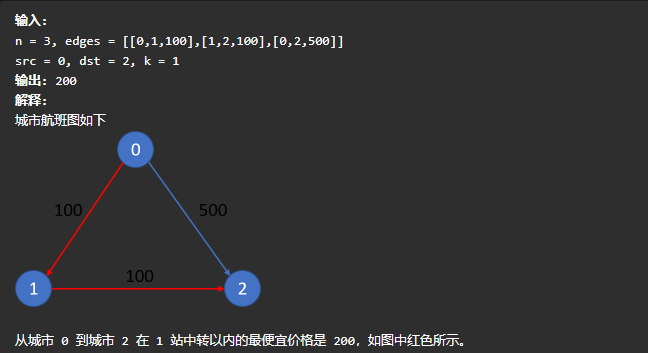

# 图

## 存图方式

我们约定点数为n，边数为m，m通常是time或者叫做waste的长度。

### 邻接矩阵

适用于稠密图，当m≈n²的时候，可以用邻接矩阵。

```java
int[] w = new int[n][m];
void add(int u,int v,int t){
    w[u][v] = t;
}
```

### 邻接表

是图论中很常见的一种存图方式，适用于稀疏涂，也就是m≈n。实现方式和单链表一样，就是以链表的形式存边。

```java
int[] he = new int[N];//头结点，存点对应边的集合（链表）
int[] ne = new int[M];//指向下一条边
int[] e = new int[M];//边的条数
int[] w = new int[M];//边的权重
//遍历所有从a出发的边
for(int i = he[u];i < e[i];i = ne[i]){
	int b = e[i];
    int c = w[i];//存在由a指向b的边，权重为c，或者说边长为c
}
```

### 类

这种简单，使用少

```java
class Edge{
    int a,b,c;
    Edge(int _a,int _b,int _c){
        this.a = _a;
        this.b = _b;
        this.c = _c;
    }
}

//访问时用list
List<Edge>() edge = new ArrayList<>();
for(Edge e : edge){
    ……
}
```

## [743.网络延迟时间](https://leetcode-cn.com/problems/network-delay-time/)

>有 n 个网络节点，标记为 1 到 n。
>
>给你一个列表 times，表示信号经过 有向 边的传递时间。 times[i] = (ui, vi, wi)，其中 ui 是源节点，vi 是目标节点， wi 是一个信号从源节点传递到目标节点的时间。
>
>现在，从某个节点 K 发出一个信号。需要多久才能使所有节点都收到信号？如果不能使所有节点收到信号，返回 -1 。
>
>
>
>```block
>输入：times = [[2,1,1],[2,3,1],[3,4,1]], n = 4, k = 2
>输出：2
>```

### 1.Floyd算法（邻接矩阵） 

```java
int[] floyd(int[] w),int n{
    for(int p = 0;p < n;p ++){//中转点
        for(int i = 0;i < n;i ++){//起点
            for(int j = 0;j < n;j ++){//终点
                w[i][j] = Math.min(w[i][j],w[i][p] + w[p][j]);//松弛操作,可选可不选
            }
        }
    }
}
public int networkDelayTime(int[][] times, int n, int k) {//1初始化图->2存图->3求最短->4遍历
	int w[][] = new int[n][n];
    int INF = 0x3f3f3f3f;
    int result = 0;
    //1
    for(int i = 0;i < n;i ++){
        for(int j = 0;j < n;j ++){
            w[i][j] = i == j ? 0 : INF;
        }
    }
    //2
    for(int[] ts : times){
        int u = ts[0],v = ts[1], c = ts[2];
        w[u][v] = c;
    }
    //3
    w = folyd(w,n);
    //4
    for(int i = 0;i < n;i ++){
        result = Math.max(result,w[k][i]);
    }
    return result >= INF / 2 ? -1 : result;
}
```

### 2.dijkstra(狄杰斯特拉算法)（邻接矩阵）

## [787.k站中转内最便宜的航班](https://leetcode-cn.com/problems/cheapest-flights-within-k-stops/)

> 有 n 个城市通过一些航班连接。给你一个数组 flights ，其中 flights[i] = [fromi, toi, pricei] ，表示该航班都从城市 fromi 开始，以价格 pricei 抵达 toi。
>
> 现在给定所有的城市和航班，以及出发城市 src 和目的地 dst，你的任务是找到出一条最多经过 k 站中转的路线，使得从 src 到 dst 的 价格最便宜 ，并返回该价格。 如果不存在这样的路线，则输出 -1。
>
> 
>
> **有限制的最短路径问题，用bellman ford**

```java

int N = 110,INF = 0x3f3f3f3f;
int[] dist = new int[N];
int[][] w = new int[N][N];
int s,t,k,n;
public int findCheapestPrice(int _n, int[][] flights, int _src, int _dst, int _k) {
    s = _src;t = _dst;k = _k + 1;n = _n;
    for(int i = 0;i < n;i ++){
        for(int j = 0;j < n;j ++){
            w[i][j] = i == j ? 0 : INF;
        }
    }
    for(int[] ts : flights){
        w[ts[0]][ts[1]] = ts[2];
    }
    int ans = bf();
    return ans > INF / 2 ? -1 : ans;
}
int bf(){
    Arrays.fill(dist,INF);
    dist[s] = 0;
    for(int p = 0;p < k;p ++){
        int[] clone = dist.clone();
        for(int i = 0;i < n;i ++){
            for(int j = 0;j < n;j ++){
                dist[j] = Math.min(dist[j],clone[i] + w[i][j]);
            }
        }
    }
    return dist[t];
}
```

